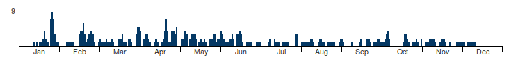

# Happy Histogram

## What

Happy Histogram (HH) is a simple JavaScript library for generating a
client side histogram showing activity across 
a year.  This JavaScript
library uses no 3rd party libraries (eg D3 or jQuery) and is barely over 900 _bytes_ in size. 
The DOM elements used are only
HTML (floating DIVs) and not any fancy Canvas or SVG. The final histogram is very 
fast to render and is 100% responsive, looking good on both mobile
and desktop browsers.

## Example

PCH's [Calendar of Internet Governance Meetings](https://pch.net/meetings). This was 
the inception page for this library:

[](https://pch.net/meetings)

## Why

I had tried a number of full blown graphing libraries ([jqPlot](http://www.jqplot.com/), [Flot](http://www.flotcharts.org/) and [jQuery sparkline](http://omnipotent.net/jquery.sparkline/), all awesome in their own right) as well, I looked at the [top available JS solutions](https://github.com/search?l=JavaScript&q=histogram&type=Repositories&utf8=%E2%9C%93). They all failed
me in one way or another.  Some of them didn't like having hundreds of data
points being rendered on them.  Some of them added unwanted anti-aliasing
on 1 pixel wide elements (I'm looking at you [Canvas](http://stackoverflow.com/questions/195262/can-i-turn-off-antialiasing-on-an-html-canvas-element)!). Many of them were
going to take a lot of effort to look good on mobile devices at the horizontal
scaled I was looking for.

So, I decided to roll my own!

## How

### Basics

1. Download [the latest HH](https://github.com/Packet-Clearing-House/Happy-Histogram/releases/latest) and grab the minified CSS and JS from the "dist" directory.
2. Include HH's JavaScript and CSS: 
   ```
   <script src="HappyHistogram.min.js" ></script>
   <link rel="stylesheet" href="HappyHistogram.min.css" />
   ```
1. Define the HTML where you want to render your histogram (must be an ID): ``<div id="hisogram"></div>``
1. Declare your data set as a multi-dimentsional array, with one sub-array for each year. 

   ```
   var Year = [
       [1,0,0,0,0,0,0,0,0,0,0,1,0,1,0,1,1,1,2,4,2,1,1,0,7,9,7,3,2,1,1],
       ...
       [1,1,0,1,1,1,1,1,1,1,0,0,0,0,0,0,0,0,0,0,0,0,0,0,0,0,0,0,0,0]
   ];
   ```
   
   Careful!  Garbage in, garbage out - HH will not validate any values, only accepts
   ints (no floats!) and will not pad for missing or ``NULL`` days.
1. Call HH specifying target, data and CSS color: ``HappyHistogram('histogram', Year);`` . Your target must be an ID, not a class. 

### Advanced

**Bar Color** - Pass in the CSS value when you
call HH: ``HappyHistogram('histogram', Year, 'red');`` or ``HappyHistogram('histogram', Year, '#ddd');``. Default color is ``#043864``

**Histogram Height** -  _After_ you have included HH's CSS, declare an update CSS entry for the height ``.yearHistogram .month .chart { height: 25px; }``

**Background Color** - _After_ you have included HH's CSS, declare an update CSS entry
for the background ``.yearHistogram .emptyTop { background-color: yellow; }``

**Hover color for just data bar** - Again, _after_ you have included HH's CSS, declare
 a ``hover`` psuedo class for just the bottom part.  Note that you'll need include
 the ID of the  DOM element for you histogram: ``#histogram .yearHistogram .filledBottom:hover {background-color: #ddd;}``

**Hover color entire bar, all the way to the top** - Again, _after_ you have included HH's CSS, declare
 a ``hover`` psuedo class for just the entire.  Note that you'll need include
 the ID of the  DOM element for you histogram: ``#histogram .yearHistogram .bar:hover {background-color: #ddd;}``

## License

MIT

## Version History

- 1.1 - 11/16/2016: Fix gap on Safari, add more examples
- 1.0 - 10/24/2016: Initial release